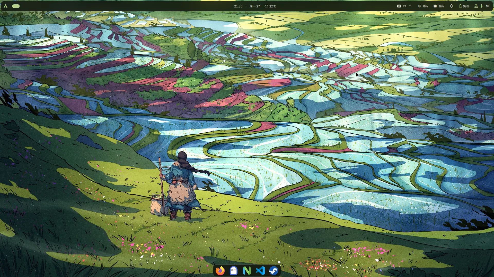
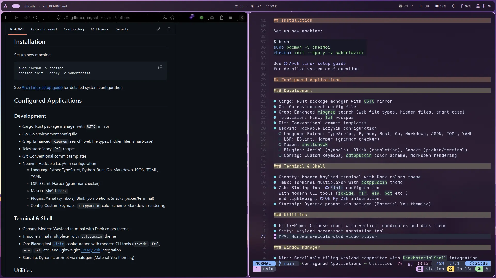
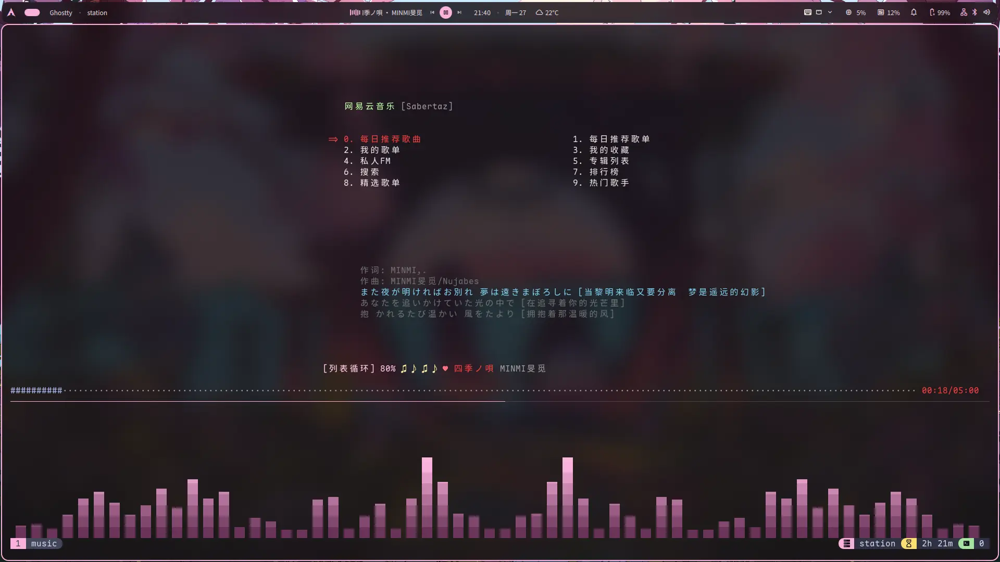
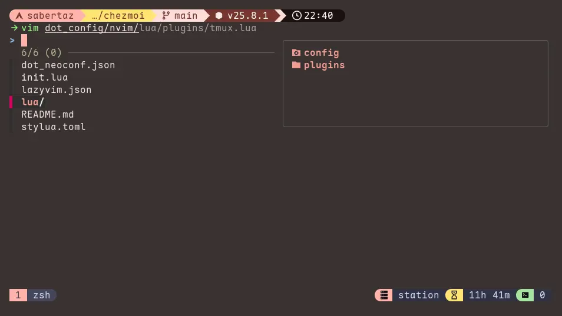
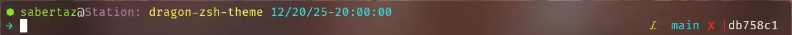
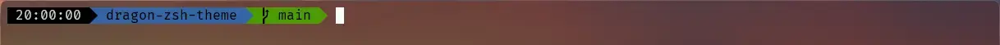

# Dotfiles

[](https://github.com/sabertazimi)
[](https://raw.githubusercontent.com/sabertazimi/dotfiles/main/LICENSE)
[](https://github.com/sabertazimi/dotfiles)

[](https://github.com/archlinux)
[](https://github.com/niri-wm/niri)
[](https://github.com/gnome)
[](https://github.com/kde)
[](https://github.com/microsoft/TypeScript)
[](https://github.com/python/cpython)
[](https://github.com/rust-lang/rust)
[](https://github.com/golang/go)
[](https://github.com/git/git)
[](https://github.com/ghostty-org/ghostty)
[](https://github.com/tmux/tmux)
[](https://github.com/ohmyzsh/ohmyzsh)
[](https://github.com/ohmybash/oh-my-bash)
[](https://github.com/starship/starship)
[](https://github.com/neovim/neovim)
[](https://github.com/anthropics/claude-code)
[](https://github.com/rime)
[](https://github.com/mpv-player/mpv)
[](https://github.com/go-musicfox/go-musicfox)
[](https://github.com/wakatime)

Hackable personal dotfiles managed with [`chezmoi`](https://github.com/twpayne/chezmoi)
(`/ʃeɪ mwa/`).






## Installation

Set up new machine:

```bash
sudo pacman -S chezmoi
chezmoi init --apply -v sabertazimi
```

See [Arch Linux setup guide](https://notes.tazimi.dev/programming/linux/arch)
for detailed system configuration.

## Configured Applications

### Development

- Cargo: Rust package manager with `USTC` mirror
- Go: Go environment config file
- Grep: Enhanced `ripgrep` search (web file types, hidden files, smart-case)
- Television: Fancy `fzf` recipes
- Git: Conventional commit templates
- Neovim: Hackable LazyVim configuration
  - Language Extras: TypeScript, Python, Rust, Go, Markdown, JSON, TOML, YAML
  - LSP: ESLint, Harper (grammar checker)
  - Mason: `shellcheck`
  - Plugins: Aerial (symbols), Blink (completion), Snacks (picker/terminal)
  - Config: Custom keymaps, `catppuccin` color scheme, Markdown rendering

### Terminal & Shell

- Ghostty: Modern Wayland terminal with Dank colors theme
- Tmux: Terminal multiplexer with `catppuccin` theme
- Zsh: Blazing fast [`Zinit`](https://github.com/zdharma-continuum/zinit) configuration
  with modern CLI tools (`zoxide`, `fzf`, `eza`, `bat` etc.)
  and lightweight [Oh My Zsh](https://github.com/ohmyzsh/ohmyzsh) integration.
- Starship: Dynamic prompt via matugen (Material You theming)

### Utilities

- Fcitx-Rime: Chinese input with vertical candidates and dark theme
- Satty: Wayland screenshot annotation tool
- MPV: Hardware-accelerated video player

### Window Manager

- Niri: Scrollable-tiling Wayland compositor with `DankMaterialShell` integration

### System

- `fontconfig`: Font rendering configuration
- MIME Apps: Default application associations

### Themes

- `DankMaterialShell`: Material You shell
- Matugen: Material You color scheme generator from wallpaper

## Wallpapers

Collection of wallpaper management scripts for Arch Linux:

- Interactive or command-line usage
- Automatic package installation
- Copies Arch Linux, GNOME, and KDE Plasma wallpapers
- `.jxl` to `.png` conversion for GNOME wallpapers
- Resolution priority selection for KDE Plasma wallpapers

```bash
# Fetch scripts
git clone --depth=1 https://github.com/sabertazimi/dotfiles.git ~/dotfiles
chmod +x ~/dotfiles/wallpapers/*.sh

# Install all wallpapers
~/dotfiles/wallpapers/install.sh

# Or run specific script
~/dotfiles/wallpapers/install.sh archlinux   # Arch Linux wallpapers
~/dotfiles/wallpapers/install.sh gnome       # GNOME wallpapers
~/dotfiles/wallpapers/install.sh kde         # KDE Plasma wallpapers
~/dotfiles/wallpapers/install.sh third-party # Third-party wallpapers
```

Wallpapers are copied to `~/.local/share/wallpapers/`.

Requirements:

- `ImageMagick` (for GNOME `.jxl` conversion)
- `archlinux-wallpaper`
- `gnome-backgrounds`
- `plasma-workspace-wallpapers`

## Shell Themes

### Zsh Theme

Minimalistic zsh prompt theme for git users:

```bash
mkdir -p ~/.oh-my-zsh/custom/themes
cp ~/dotfiles/themes/zsh/dragon.zsh-theme ~/.oh-my-zsh/custom/themes/
sed -i 's/^ZSH_THEME=".*"/ZSH_THEME="dragon"/' ~/.zshrc
source ~/.zshrc
```



### Bash Theme

Minimalistic bash prompt theme for git-bash on Windows:

```bash
mkdir -p ~/.oh-my-bash/custom/themes/dragon
cp ~/dotfiles/themes/bash/dragon.theme.sh ~/.oh-my-bash/custom/themes/dragon/
sed -i 's/^OSH_THEME=".*"/OSH_THEME="dragon"/' ~/.bashrc
source ~/.bashrc
```



## Caveats

Dotfiles not synced:

`~/.gitconfig`, `~/.claude.json`, `~/.claude/settings.json`
contain keys and dynamically generated content.

## License

MIT License Copyright (c) [`Sabertaz`](https://github.com/sabertazimi)

## Contact

[](https://github.com/sabertazimi)
[](mailto:sabertazimi@gmail.com)
[](https://x.com/sabertazimi)
